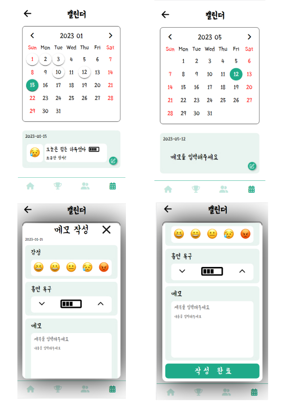

# Calendar

  <h1>금연 어플 달력</h1>
  
개발환경 : Window 운영체제, Node.js로 express 웹 프레임워크를 사용

  
개발언어 : ejs, jquery, javaSript

  
응용기술: DB.json을 생성해 서버에서 프론트엔드로 전달

  <h3>주요 기능 소개</h3>
  <ul>
    <li>날짜 및 요일 확인 가능(작년, 재작년, 내년 등 모두 포함)</li>
    <li>날짜 선택 기능</li>
    <li>선택된 날짜 표기 기능(날짜 숫자색 변경)</li>
    <li>날짜 선택 시, 해당 날짜에 대한 금연 메모 보여주기 기능</li>
    <li>금연 메모 목록에 글쓰기 추가 기능(해당 날짜의 금연 메모로 추가됨)</li>
    <li>다른 날짜 선택시, 새롭게 선택된 날짜에 대한 금연 메모 보여주기 기능</li>
  </ul>

  <h3>구현방안</h3>
  

    <h4>메모 작성 팝업창</h4>
    
작성한 글이 캘린더 아래 메모 창에 보이게 하기 위해서form을 만들고 그 안에 5개의 input을 만들었다. input의 value 값을 DB.json에 넘겨 나중에 화면에 입력되게 하도록 계획했다.
      첫 번째 ‘감정’, 두 번째 ‘흡연욕구’는 이미지이기 때문에 해당 이미지(아이콘)을 클릭하면 각각 숫자 값을 부여하도록 했고 input의 type을 hidden으로 설정해 화면에 input 화면이 보이지
      않도록 설정했다. 세 번째 ‘제목’, 네 번째 ‘내용입력’칸은 바로 value값으로 보내지기 때문에 별도의 값 설정은 필요치 않았다.
      input 태그 뒤에 required를 입력해 모든 항목을 작성할 수 있도록 하였다. 사용자가 첫 번째, 두 번째는 이미지 항목을 선택하지 않고 메모만 입력하고 보내는 경우가 있을 것 같아 시도해봤는데
      오류가 발생했다. 이런 경우를 대비해 첫 번째, 두 번째에 기본 값을 설정했다.

    
팝업창 상단에는 해당 폼에 날짜를 기입했고 메인페이지의 메모작성 란에 함께 작성되도록 하였다. 날짜 객체를 만들어 json에 해당 폼의 속성과 값이 입력되도록 했다.
      첫 번째 ‘감정’의 이모티콘 선택했을 때 처음엔 호버로만 이벤트를 줬었는데 누른 선택항목이 특정하게 잡히지 않아서 이를 해결하기 위해 먼저 5개의 이모티콘에 기존에 없던 클래스 active를 제거하고 바로
      누른 이모티콘에 클래스 active를 추가해 특정 시켜주었다.
      두 번째 ‘흡연욕구’는 기본 값을 3단계로 설정했고 증가/감소 버튼을 만들어 1~5단계를 벗어나지 않도록 설정했다. 

  

  <!--popup-->
  

    
메인페이지에는 현재 연도, 월을 보여주면서 이전/다음 버튼을 통해 이전/다음 달 달력을 볼 수 있도록 했고 팝업창에서 작성한 폼을 전송받아 메모에 표시되도록 했다.
      각 날짜 일에 div박스를 만들어 해당 날짜를 id값으로 설정했고, 달력에서 빈 부분(이전 달말 날짜나 다음 달 초 날짜)에는 선택하지 못하게 만들었다. 

    
해당 날짜를 표기하기 위해서 해당 날짜 선택 시 모든 날짜에 클래스 select를 제거하고 해당 날짜만 select를 추가했고 선택된 날짜가 한 눈에 보일 수 있게 했다

    
날짜 선택 시, 해당 날짜에 대한 메모를 볼 수 있도록 했고, 날짜 일에 스트로크를 줬다. 

  

  <!--main-->
  
추후에는 사용자가 해당 날짜에 메모를 많이 추가하게 될 것을 고려하여 스크롤 생성을 하려고 한다. 

  

  <h3>산출물 이미지</h3>
  
